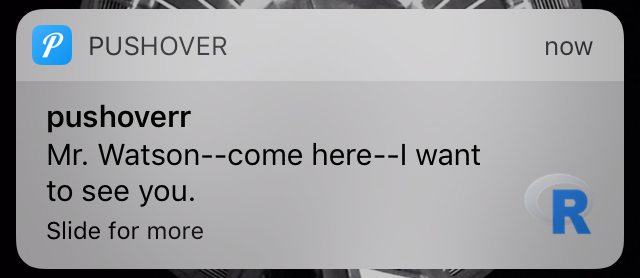
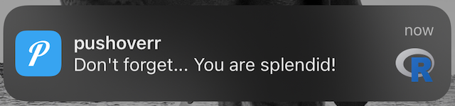
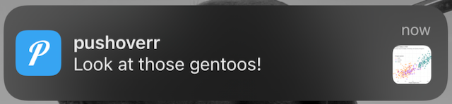
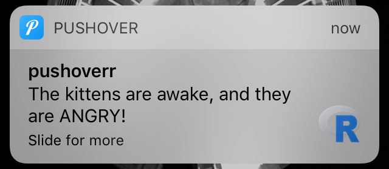
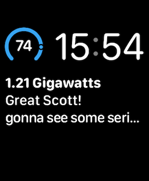

<!-- README.md is generated from README.Rmd. Please edit that file -->

# pushoverr

<!-- badges: start -->

[](https://app.codecov.io/gh/briandconnelly/pushoverr?branch=master)
[](https://github.com/briandconnelly/pushoverr/actions)
[](https://CRAN.R-project.org/package=pushoverr)
<!-- badges: end -->

pushoverr allows you to send push notifications from R to mobile devices
or the desktop using [Pushover](https://pushover.net/). These
notifications can display job status, results, scraped web data, or any
other text or numeric data. Got some R code that takes a while to
complete? Enough time to take a little walk or go get a coffee, but
maybe not long enough to go home for the day? Now you’ll be able to
easily let yourself or your group know when it’s done.

## Prerequisites

You’ll need an account with [Pushover](https://pushover.net/). Once you
have that, log in and [register an
application](https://pushover.net/apps/build). You should now have two
codes—a **user key** and an **API token/key**. These are what identify
you and your app(s) to Pushover. You’ll pass these along to pushoverr
whenever you send a message (see [Saving Your
Credentials](#saving-your-credentials)). You’ll also need the Pushover
app for [iOS](https://pushover.net/clients/ios),
[Android](https://pushover.net/clients/android), or your
[desktop](https://pushover.net/clients/desktop).

## Installation

Installing pushoverr is as easy as running:

``` r
install.packages("pushoverr")
```

Alternately, you can install the development version of pushoverr from
[GitHub](https://github.com/) with:

``` r
# install.packages("devtools")
devtools::install_github("briandconnelly/pushoverr")
```

## Using pushoverr

Now that pushoverr’s been installed, you’re ready to start pushing some
notifications. To begin using pushoverr, you’ll need to first load the
library. To do this, run:

``` r
library(pushoverr)
```

### Example 1: Send Yourself A Message

pushoverr’s primary function is `pushover()`, which allows you to send
messages along with other optional things like sounds, links, and
images.

``` r
pushover(message = "Mr. Watson--come here--I want to see you.")
```

You’ll be prompted for your user key and app token until you [set them
up](#saving-your-credentials).

Within just a few seconds, your phone/tablet/whatever should be abuzz
with this historic message.



The `message` and `title` arguments are evaluated with
[`glue()`](https://glue.tidyverse.org/reference/glue.html), so you can
add more context:

``` r
pushover(message = "Don't forget... {praise::praise()}")
```



### Saving your Credentials

By default, pushoverr will prompt you for your key and app token when
needed and save them for all subsequent commands. You can specify a key
and token to use for the rest of your session using `set_pushover_user`
and `set_pushover_app`:

``` r
set_pushover_user(user = "uQiRzpo4DXghDmr9QzzfQu27cmVRsG")
set_pushover_app(token = "azGDORePK8gMaC0QOYAMyEEuzJnyUi")
```

pushoverr will forget these as soon as you end your session, so you’ll
have to re-run these commands each time you restart R.

Alternatively, you can store your keys in your `.Renviron` file. If you
have [usethis](https://usethis.r-lib.org/), run
`usethis::edit_r_environ()` to open it for editing.

``` r
PUSHOVER_USER = "uQiRzpo4DXghDmr9QzzfQu27cmVRsG"
PUSHOVER_APP= "azGDORePK8gMaC0QOYAMyEEuzJnyUi"
```

With this approach, these keys will be used any time you use pushoverr.
Although these values will be used by default, they can easily be
overridden by supplying different values as arguments.

### Example 2: Sending an Image

Images such as plots can also be sent as attachments.

``` r
pushover(
  message = "Look at those gentoos!",
  attachment = "penguins.png"
)
```



The full-size image can be seen in the app.


### Example 3: Send Yourself an Important Message

Messages can be given different priorities ranging from silent to
emergency. Quiet messages arrive without playing a sound, high priority
messages arrive with a reddish background, and emergency messages arrive
and repeat until they’ve been acknowledged. `pushoverr` provides easy
methods for sending these:

``` r
pushover_quiet(message = "The kittens are sleeping")
```

Or more urgently:

``` r
msg <- pushover_emergency(message = "The kittens are awake, and they are ANGRY!")
```



Emergency messages return a receipt token that can be checked with
`is.acknowledged()` to see whether or not it has been seen.

``` r
is.acknowledged(receipt = msg$receipt)
```

### Example 4: Results on your Wrist

Pushover can now show data on constantly-updated screens like your
smartwatch or lock screen (where supported). Using `update_glance`, you
can push short text messages, numbers, and percentages to your watch
right from within R.

``` r
update_glance(count = 88)
```


Additional pieces of information can be shown depending on your chosen
watch face and complications.

``` r
speed <- 74.0
current_power_gw <- 1.21

update_glance(
  count = speed,
  percent = speed / 88.0,
  text = "Great Scott!",
  title = "{current_power_gw} Gigawatts",
  subtext = "gonna see some serious sh*t"
)
```




Note that these updates should be done infrequently—no more than once
every 20 minutes or so—or WatchOS will stop processing updates to
promote battery life. If you encounter problems, WatchOS resets this
limit overnight.

## Features Not Supported

pushoverr does not currently support
[subscriptions](https://pushover.net/api/subscriptions),
[licensing](https://pushover.net/api/licensing) (I don’t use Pushover in
this context, so I can’t test these features), or the [open client
API](https://pushover.net/api/client). If you’d like to see these
features supported, please submit an
[issue](https://github.com/briandconnelly/pushoverr/issues) or a pull
request.

## Related Links

-   [Pushover](https://pushover.net)
    -   [FAQ](https://pushover.net/faq)
    -   [API](https://pushover.net/api)
    -   [Terms of Service](https://pushover.net/terms)
-   [R Phone Home: Notifications with
    pushoverr](http://bconnelly.net/2016/11/R-phone-home/), blog post
    about using pushoverr
-   [NotifyR](https://cran.r-project.org/package=notifyR), an alternate
    Pushover tool for R (no longer maintained?)
-   [RPushbullet](https://github.com/eddelbuettel/rpushbullet), an R
    interface for [Pushbullet](https://www.pushbullet.com), a similar
    push notification service.

## Code of Conduct

Please note that the pushoverr project is released with a [Contributor
Code of
Conduct](https://contributor-covenant.org/version/2/0/CODE_OF_CONDUCT.html).
By contributing to this project, you agree to abide by its terms.

## Disclaimer

This package and its author are not affiliated with Pushover, LLC.
