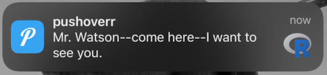
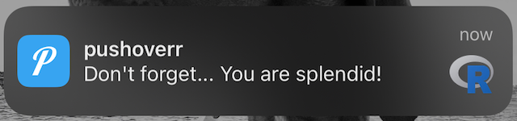
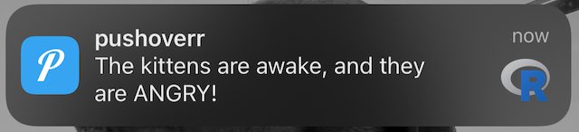

```{r, include = FALSE}
knitr::opts_chunk$set(
  collapse = TRUE,
  eval = FALSE,
  comment = "#>"
)
```

This guide will help you get started with pushoverr.
In just a few minutes, you'll be able to send rich notifications to your mobile devices, desktop, and even watches.

## Prerequisites

First, you'll need an account with [Pushover](https://pushover.net/).
Once you have that, log in and [register an application](https://pushover.net/apps/build).
You should now have two codes---a **user key** and an **API token/key**.
These are what identify you and your app(s) to Pushover.
You'll pass these along to pushoverr whenever you send a message.
You'll also need the Pushover app for [iOS](https://pushover.net/clients/ios), [Android](https://pushover.net/clients/android), or your [desktop](https://pushover.net/clients/desktop).


## Installation and Setup

If you haven't already installed pushoverr, start an R session and run:

```{r eval=FALSE}
install.packages("pushoverr")
```

Now, let's load the package:

```{r eval=FALSE}
library(pushoverr)
```


## Configuring Pushover Credentials

By default, pushoverr will prompt you for your key and app token when needed and save them for all subsequent commands.
You can directly tell pushoverr your key and token using `set_pushover_user` and `set_pushover_app`.
For example:

```{r eval=FALSE}
set_pushover_user(user = "uQiRzpo4DXghDmr9QzzfQu27cmVRsG")
set_pushover_app(token = "azGDORePK8gMaC0QOYAMyEEuzJnyUi")
```

You'll need to use your own user key and app token.

pushoverr will forget these as soon as you end your session, so you'll have to re-run these commands each time you restart R.

Alternatively, you can store your keys in your `.Renviron`.
If you have [usethis](https://usethis.r-lib.org/), run `usethis::edit_r_environ()`.

```{r eval=FALSE}
PUSHOVER_USER = "uQiRzpo4DXghDmr9QzzfQu27cmVRsG"
PUSHOVER_APP= "azGDORePK8gMaC0QOYAMyEEuzJnyUi"
```
    
With this approach, your keys will be set whenever you use R.
pushoverr will use these keys by default, but they can easily be overridden by supplying different values as arguments.


## Using pushoverr

### Example 1: Send Yourself A Message

Now that your credentials are configured, you're ready to send your first message.

```{r eval=FALSE}
pushover(message = "Mr. Watson--come here--I want to see you.")
```

Within just a few seconds, your phone/tablet/watch/whatever should be abuzz with this historic message.



Using other arguments to `pushover`, you can configure other aspects of your message, including sounds, links, and message priorities.

The `message` and `title` arguments are evaluated with [`glue()`](https://glue.tidyverse.org/reference/glue.html), so you can add more context:

```{r eval=FALSE}
pushover(message = "Don't forget... {praise::praise()}")
```




### Example 2: Sending an Image

Images such as plots can also be sent as attachments.

```{r eval=FALSE}
pushover(
  message = "Look at those gentoos!",
  attachment = "penguins.png"
)
```


The full-size image can be seen in the app.


### Example 3: Send Yourself an Important Message

Messages can be given different priorities ranging from silent to emergency.
Quiet messages arrive without playing a sound, high priority messages arrive with a reddish background, and emergency messages arrive and repeat until they've been acknowledged.
`pushoverr` provides easy methods for sending these:

```{r eval=FALSE}
pushover_quiet(message = "The kittens are sleeping")
```

Or more urgently:

```{r eval=FALSE}
msg <- pushover_emergency(message = "The kittens are awake, and they are ANGRY!")
```



Emergency messages return a receipt token that can be checked with `is.acknowledged()` to see whether or not it has been seen.

```{r eval=FALSE}
is.acknowledged(receipt = msg$receipt)
```


### Example 4: Results on your Wrist

Pushover can now show data on constantly-updated screens like your smartwatch or lock screen (where supported).
Using `update_glance`, you can push short text messages, numbers, and percentages to your watch right from within R.

```{r eval=FALSE}
update_glance(count = 88)
```


Additional pieces of information can be shown depending on your chosen watch face and complications.

```{r eval=FALSE}
speed <- 74.0
current_power_gw <- 1.21

update_glance(
  count = speed,
  percent = speed / 88.0,
  text = "Great Scott!",
  title = "{current_power_gw} Gigawatts",
  subtext = "gonna see some serious sh*t"
)
```


Note that these updates should be done infrequently---no more than once every 20 minutes or so---or WatchOS will stop processing updates to promote battery life.
If you encounter problems, WatchOS resets this limit overnight.
